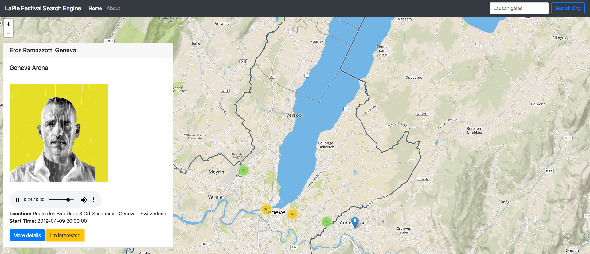

# LaPie Festival Search Engine

WebApp allowing users to find concerts/festivals around them and all over the world. When clicking on an event, it displays informations about it, informations about the artist and even plays a Spotify top track sample from the artist.

Users can also be interested by an event. This informations will then be shared to other users.



## The project

The project has been built with different technologies :

- Flask which is here used as an API REST server and HTTP server.

- HTML/CSS, JavaScript/JQuery, Bootstrap for the website.

- Web Sockets to have a real time interaction when users are interested in an event.

- DynamoDB to store informations about events, artists and users.

## How to launch the project ?

1) Clone the repository

2) If you're using *virtualenv*, install the requirements to get all the packages necessary to run the program.

```
pip install -r path/to/requirements.txt
```

3) Specify the name of our app to Flask

```
export FLASK_APP=__init__.py
```

4) Download a local version of [DynamoDB](https://docs.aws.amazon.com/amazondynamodb/latest/developerguide/DynamoDBLocal.DownloadingAndRunning.html)

5) With an other terminal, go inside the folder you just downloaded and run this command. This will launch the database.

```
java -Djava.library.path=./DynamoDBLocal_lib -jar DynamoDBLocal.jar -sharedDb -port 5002
```

6) In the main repository run the app

```
flask run
```

The server HTTP and REST are now accessible at

```
http://127.0.0.1:5000/
```

The entire website is also visible online at this address : [https://apu10nz939.execute-api.eu-west-1.amazonaws.com/dev/](https://apu10nz939.execute-api.eu-west-1.amazonaws.com/dev/)


## API Documentation

This project integrate an API documentation. In order to generate it you need to install [APIDoc](http://apidocjs.com/) with *NPM*.

2) Run the following command inside the main folder

```
apidoc -i . -o apidoc/
```

## Services used

### Music samples :musical_score:

- [Spotify](https://developer.spotify.com/)

### Informations about concerts/festivals :pencil2:

- [EventFul](http://api.eventful.com/)

### Informations about artists :pencil2:

- [MusicBrainz](https://musicbrainz.org/doc/Development)

### Map :earth_africa:

- [Open Street Map](https://wiki.openstreetmap.org/wiki/Develop) 

 


